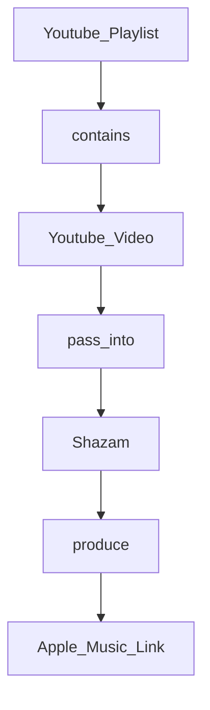

# youtube_playlist_to_music_app
## Abstract
The aim here is to retrieve Apple Music links corresponding to songs extracted from a Youtube video, themselves in a given Youtube playlist.
The basic concept of it is illustrated just bellow:

As shown in the graph, I would like to:
1. get a list of the Youtube Videos contained in the Youtube Playlist, from the Youtube Playlist Link.
2. pass the element of my previously made list into shazam
4. get the Apple Music Link from the shazam result
5. put each Apple Music Link into a list

## Issues
The first issue is: how can I ensure that the music detected by Shazam corresponds to my Youtube video? Shazam can produce totally erroneous results, or even nothing at all.

One option might be to retrieve the raw audio from the Shazam result and the original Youtube video and make a comparison (via a calculation), and on this basis we could give a score to the result obtained (awful, decent, great). Then, if the result is awful, we run the audio through Shazam again to get a different result? If the result doesn't change or improve..... *what do we do??*

I don't know if this is a good solution yet, but I think I'll try it out first, and then make a decision based on the performance of this method.

Another problem arises if the music is not available on Apple Music. For this problem, I think I'll try to look for a platform that indexes a bunch of music (I'm not talking about the audio but just the artist and the name of the song) so that I can have a complete list of all the music I listen to, not just the music that isn't available on Apple Music.

However, this is a problem I'll save for my future self, and I'm not going to deal with it for now.

## Tasks
For now I need to:
- Check Shazam API
  - [ ] see if it is possible to pass a link to Shazam
  - [ ] see how does Shazam get its result
  - [ ] see if it is possible to get the Apple Music Link within the Shazam result
- Check Youtube API
  - [ ] see if I can skim through a Youtube Playlist to get its video 
- [x] Update ReadMe
- [ ] Search for a plateform (website...) that would host a huge amount of music reference
- [ ] Search for a good calculation to estimate the similarity of two audio
